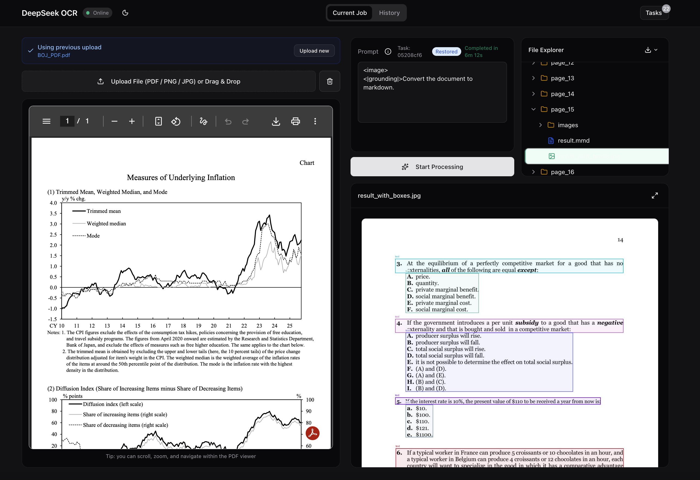
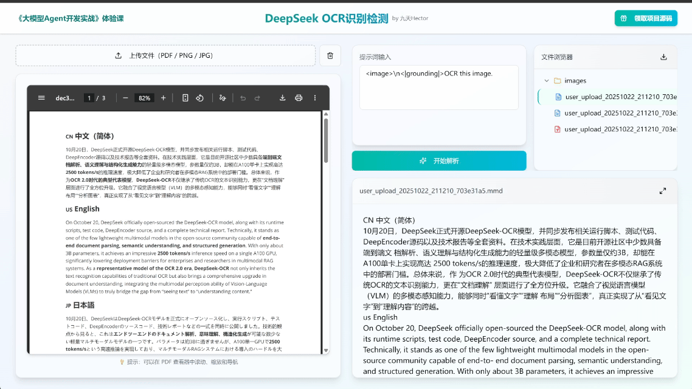
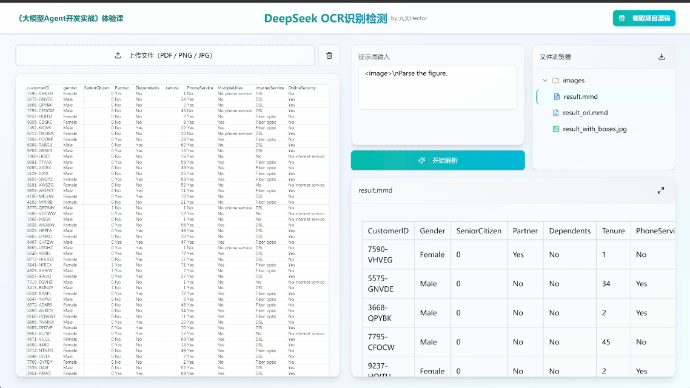
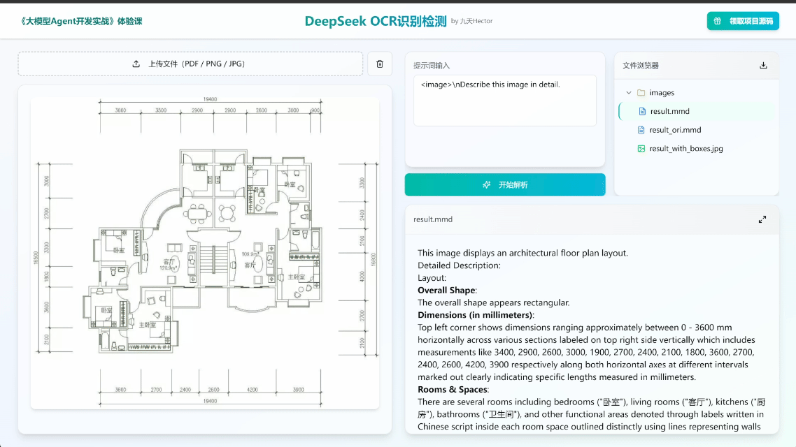
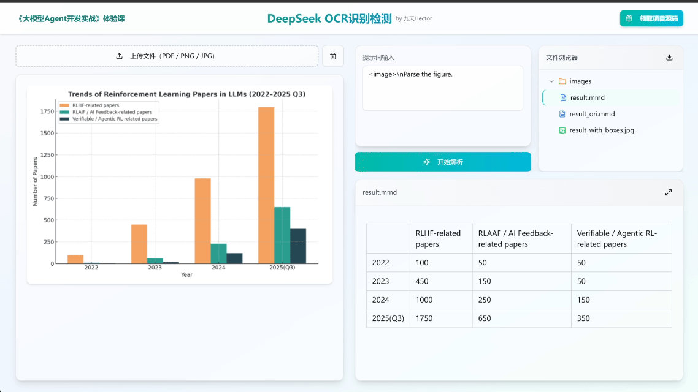

<div align="center">
  <h1>DeepSeek-OCR Studio</h1>
</div>

## Project Overview

This project is a multimodal document parsing tool based on DeepSeek-OCR with Next.js frontend and FastAPI backend.

**Designed for Nvidia DGX Spark**: This repository is optimized for the Nvidia DGX Spark environment. Docker builds install the official PyTorch CUDA 13 (`cu130`) wheels. On GB10 (`sm_121`) you may still see a PyTorch warning about supported CUDA capability; this is expected and does not necessarily mean GPU inference will fail.



This tool can efficiently process PDF documents and images, providing powerful Optical Character Recognition (OCR) capabilities, supporting multi-language text recognition, table parsing, chart analysis, and many other features.

### Key Features

- **Multi-format Document Parsing**: Supports uploading and parsing documents in various formats such as PDF and images
- **Intelligent OCR Recognition**: Based on the DeepSeek-OCR model, providing high-precision text recognition
- **Layout Analysis**: Intelligently recognizes document layout structure and accurately extracts content layout
- **Multi-language Support**: Supports text recognition in multiple languages including Chinese and English
- **Table & Chart Parsing**: Professional table recognition and chart data extraction functionality
- **Professional Domain Drawing Recognition**: Supports semantic recognition of various professional domain drawings
- **Data Visualization**: Supports reverse parsing of data analysis visualization charts
- **Markdown Conversion**: Converts PDF content to structured Markdown format

## Project Demo

<div align="center">

**PDF Document Parsing - Supports complex content including images and tables**


</div>

<div align="center">

| Multi-language Text Parsing | Chart & Table Parsing |
|:---:|:---:|
|  |  |

</div>

<div align="center">

| Professional Domain Drawing Recognition<br/>(CAD, Flowcharts, Decorative Drawings) | Data Visualization Chart<br/>Reverse Parsing |
|:---:|:---:|
|  |  |

</div>

## Usage Guide

### System Requirements

**Important Notice**:
- **Platform**: Nvidia DGX Spark (optimized) / Linux
- **GPU Requirements**: GPU >= 7 GB VRAM (16-24 GB recommended for large images/multi-page PDFs)
- **Compatibility Note**: Uses PyTorch CUDA 13 (`cu130`) wheels for Blackwell-family GPUs. Some builds may still warn on GB10 (`sm_121`).

### Quick Start

This repository is designed for a **one-step setup** on Nvidia DGX Spark.

Choose one of the following methods:

| Method | Best For | Setup Time |
|--------|----------|------------|
| [Docker (Recommended)](#method-1-docker-recommended) | Production, Nvidia DGX Spark, Easy setup | ~10 min |
| [Native Script](#method-2-native-script) | Development, Custom setup | ~20 min |
| [Manual Installation](#method-3-manual-installation) | Full control | ~30 min |

---

### Method 1: Docker (Recommended)

Docker provides the easiest setup with all dependencies pre-configured, specifically tailored for Nvidia DGX Spark with PyTorch CUDA 13 (`cu130`).

**Prerequisites:**
- Docker 20.10+
- NVIDIA Container Toolkit ([installation guide](./DOCKER.md#1-install-nvidia-container-toolkit))
- ~20 GB disk space

**Quick Start:**
```bash
# 1. Download model weights
pip install modelscope
mkdir -p ./deepseek-ocr
modelscope download --model deepseek-ai/DeepSeek-OCR --local_dir ./deepseek-ocr

# 2. Build and run (Optimized for Nvidia DGX Spark)
# Use --network=host if you have DNS issues
docker build --network=host -t deepseek-ocr-web .
docker run -d --gpus all \
  -p 8002:8002 -p 3001:3000 \
  -v ./deepseek-ocr:/app/deepseek-ocr:ro \
  -v ./workspace:/app/workspace \
  --restart unless-stopped \
  --name deepseek-ocr-web \
  deepseek-ocr-web

# 3. Access the application
# Frontend: http://localhost:3001 (or http://<tailscale-ip>:3001)
# Backend:  http://localhost:8002
```

For detailed Docker documentation including development mode, troubleshooting, and configuration options, see **[DOCKER.md](./DOCKER.md)**.

---

### Method 2: Native Script

One-click setup for native installation (requires Conda).

```bash
# Install dependencies and download model
bash install.sh

# Start services
bash start.sh
```

**Access:**
- Frontend: http://localhost:3001 (or http://<tailscale-ip>:3001)
- Backend: http://localhost:8002

---

### Method 3: Manual Installation

For full control over the installation process.

#### Step 1: Download Model Weights

```bash
pip install modelscope
mkdir ./deepseek-ocr
modelscope download --model deepseek-ai/DeepSeek-OCR --local_dir ./deepseek-ocr
```

#### Step 2: Setup Environment

```bash
# Create Conda environment
conda create -n deepseek-ocr -c conda-forge python=3.12 nodejs=22 -y
conda activate deepseek-ocr

# Install PyTorch
pip install torch torchvision torchaudio

# Install dependencies
pip install -r requirements.txt

# Optional: Install flash-attn for acceleration
pip install flash-attn --no-build-isolation
```

#### Step 3: Configure Environment

Create `.env` file in project root:
```
MODEL_PATH=/path/to/deepseek-ocr
```

#### Step 4: Start Services

```bash
# Terminal 1: Backend
cd backend
uvicorn main:app --host 0.0.0.0 --port 8002 --reload

# Terminal 2: Frontend
cd frontend
npm install
# Use 3001 for easy remote access (e.g. via Tailscale)
npm run dev -- --hostname 0.0.0.0 --port 3001
```

---

## File Locations

| Data | Location | Description |
|------|----------|-------------|
| Uploaded Files | `workspace/uploads/` | Original PDFs and images |
| OCR Results | `workspace/results/` | Markdown output, annotated images |
| Job History | `workspace/logs/` | Task status and metadata |
| Model Weights | `deepseek-ocr/` | DeepSeek-OCR model files |

---

## Documentation

- **[DOCKER.md](./DOCKER.md)** - Docker deployment guide, development mode, troubleshooting

---

## Contributing

We welcome contributions through GitHub PR submissions or issues. All forms of contribution are appreciated, including feature improvements, bug fixes, or documentation optimization.

## Technical Communication

Scan to add our assistant, reply "DeepSeekOCR" to join the technical communication group.

<div align="center">

</div>
